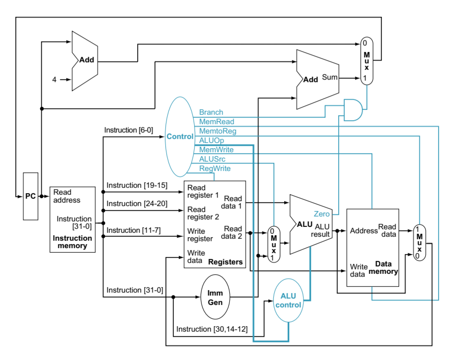
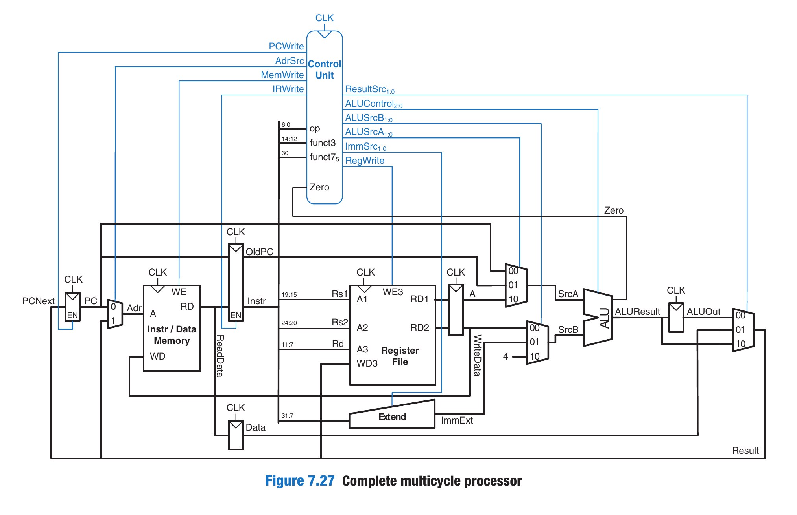

# RISC-V HDL Implementations

## Single Cycle (Completed)
- Textbook followed- 
    - "The Morgan Kaufmann Series in Computer Architecture and Design - RISCV Edition - Patterson & Hennessey"
- Implemented in
    - Verilog
- Instructions Implemented

   - | R-Type | I-Type | S-Type | B-Type |
     |--------|--------|--------|--------|
     | ADD, AND, OR    | LW     | SW     | BEQ    |

- Datapath
    - 
## Multi Cycle (Current)
- Textbook followed-
    - "Digital Design and Computer Architecture - Second Edition - David Money Harris & Sarah L. Harris"
- Implemented in
    - SystemVerilog
- Datapath
    - 

## ..... and more 
