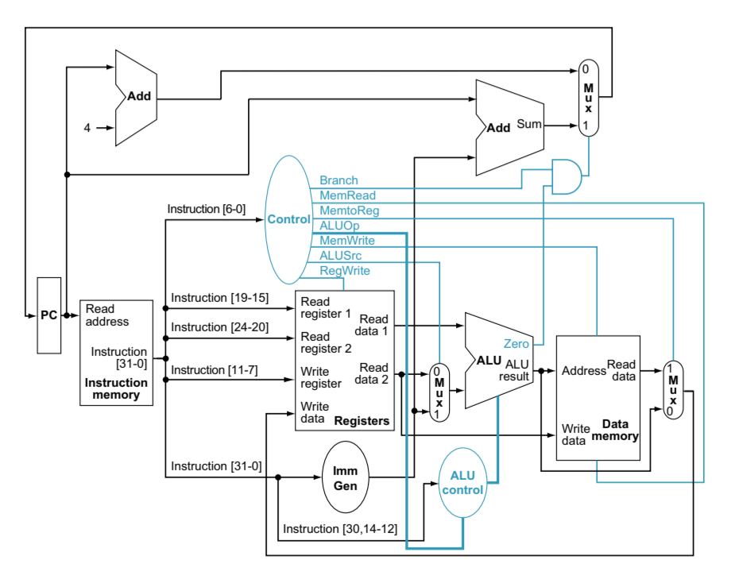
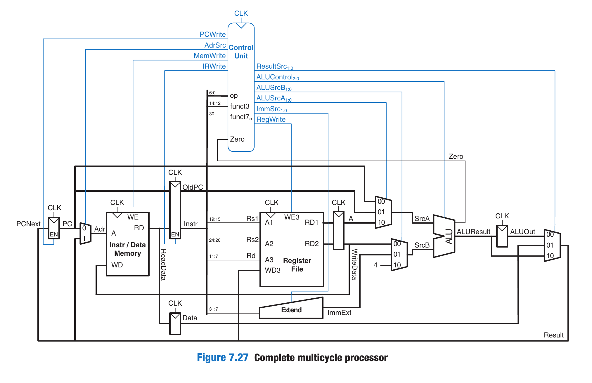

# RISC-V HDL Implementations

## Single Cycle (Completed)
- Textbook followed- 
    - "The Morgan Kaufmann Series in Computer Architecture and Design - RISCV Edition - Patterson & Hennessey"
- Implemented in
    - Verilog
- Instructions Implemented

   - | R-Type | I-Type | S-Type | B-Type |
     |--------|--------|--------|--------|
     | ADD, SUB, AND, OR    | LW     | SW     | BEQ    |

- Datapath
    - 
## Multi Cycle (Completed)
- Textbook followed-
    - "Digital Design and Computer Architecture - Second Edition - David Money Harris & Sarah L. Harris"
- Implemented in
    - SystemVerilog
- Instructions Implemented
    - | R-Type | I-Type | S-Type | B-Type |
      |--------|--------|--------|--------|
      | ADD, SUB, AND, OR | LW | SW | BEQ |
- Datapath
    - 
- Test
    - `verilator --binary --timing --top-module tb_riscv_mc -f cpu_multi_cycle/files.txt --Mdir /tmp/riscv_mc_obj && /tmp/riscv_mc_obj/Vtb_riscv_mc`

## ..... and more 
